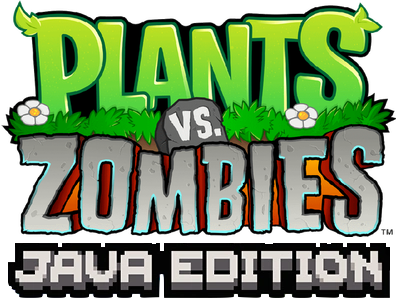

# Plants vs Zombies: Java Edition

<!-- Installation -->

## Download & Install Visual Studio Code
First, download Visual Studio Code from the [official website](https://code.visualstudio.com/) and follow the installation instructions for your operating system.

## Open Visual Studio Code
Once installed, launch Visual Studio Code from your applications or desktop.

## Open Directory with Downloaded PvZ Files
Navigate to the directory where you downloaded the Plants vs Zombies (PvZ) Java files using the file explorer in Visual Studio Code.

<!-- Game Play -->

## Open PvZ.java File
Locate the PvZ.java file within the directory you opened in Visual Studio Code.

## Click Run Button
In Visual Studio Code, locate the "Run" button, typically found in the toolbar or under the "Run" menu. Click on it to compile and execute the PvZ.java file.

## Name Pop Up Screen
Upon running the game, a pop-up screen may prompt you to enter a name for your player profile. Enter your desired name and proceed.

## Click On Sun Sprites- They are your currency!
In the game interface, click on the sun sprites that appear on the screen. These sun sprites serve as your currency, which you'll use to plant various plants for defense.

## Collect Enough Suns To Plant Plants Of Your Choice
Continue collecting sun sprites by clicking on them until you have accumulated enough to plant the plants of your choice. Plant sunflowers to create more suns quicker and catch the ones that fall on them. Strategically select plants to defend your home from the incoming zombie waves.

## Defend Your Home From Zombies!
Deploy your chosen plants strategically to fend off the waves of zombies advancing towards your home. Use a combination of offensive and defensive plants to protect your territory.
-  
-  

## Win or Lose!
The game will progress with waves of zombies attacking your home. Your objective is to survive each wave and prevent the zombies from breaching your defenses. Depending on your performance, you will either emerge victorious by repelling all the zombies or succumb to the zombie invasion.
-  
- 
